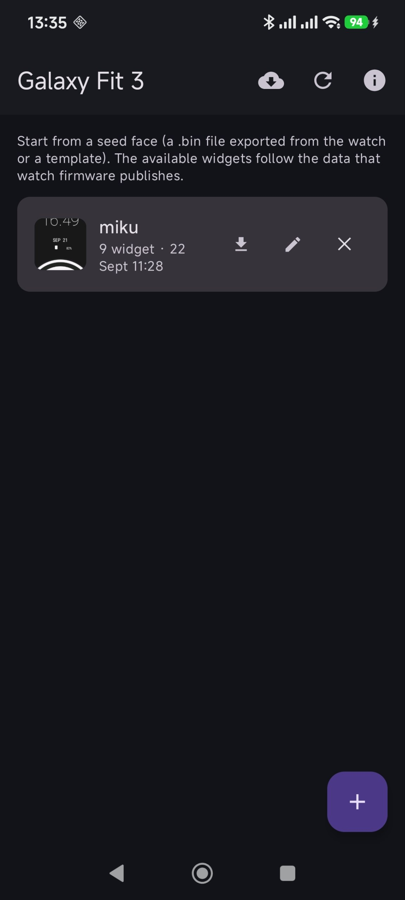
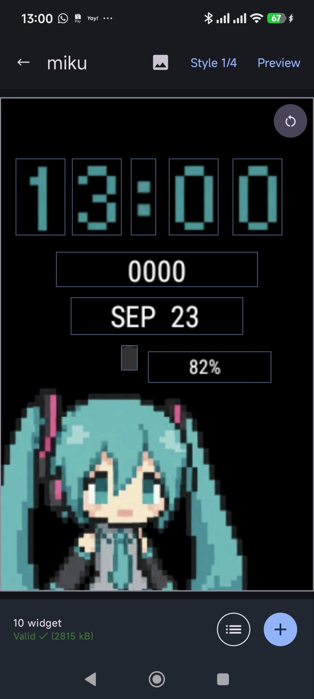
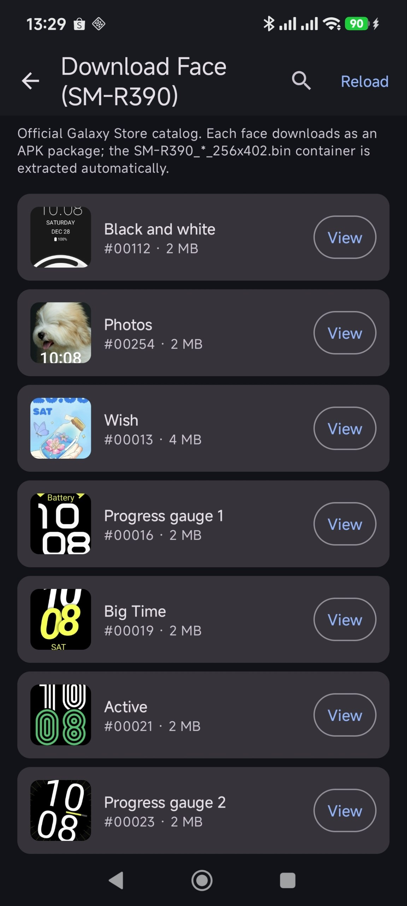
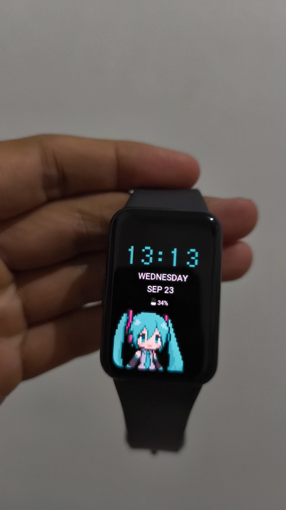

# ⚠️ VIBECODING PROJECT ⚠️

> **This app is a fully VIBECODED project.**
>
> It was written quickly, experimentally, and mostly on a whim — with little to
> no formal testing, documentation, or design review. Bugs, inconsistencies,
> and unfinished behavior may appear in any version, now or in the future.
>
> If something looks wrong, missing, or out of place, it is probably a *known*
> side effect of how this app was made, not an accident you should file as a
> one-off bug.
>
> **Use it at your own risk, and please be patient.** If some widgets appear in
> the wrong position inside the editor but look fine on the watch, that
> mismatch is expected — it does not mean your face is broken.

---

# Galaxy Fit 3 — Custom Face

A hobby Android app to build and install **custom watch faces** for the
Samsung **Galaxy Fit 3 (SM-R390)**.

You pick a stock face as a seed, edit what is on it (background, frame,
widgets, positions, rotation), export the result, and push it to your watch —
right from your phone.

## Features

- Browse and pick a stock Galaxy Fit 3 face as your starting seed.
- Edit the face in an on-device editor: background/frame, reusable widgets,
  dragging, sizing, rotation, and more.
- Export the face and install it on a connected Galaxy Fit 3 via the companion
  app.
- Import/export face binaries so you can back up or share your work.
- Built-in update check for new releases of this app.

## Inspiration & thanks

This project was **heavily inspired by
[fitface-studio](https://github.com/satvikgosai/fitface-studio)** — thank you,
Satvik, for the original work and the idea. Go check that project out too.

## Notes & expectations

- This is a **vibecoded hobby project** (see the banner at the top). Please
  set your expectations accordingly.
- Updates are **irregular**: this app only moves forward when there is
  inspiration, spare time, and access to the watch hardware.
- The features are bounded by **what the watch firmware itself allows** — the
  editor cannot add capabilities the watch's format does not support.
- You are welcome to **fork this project** and open **merge requests** if you
  would like to — contributions are appreciated.

## Building

- Requires JDK 17+ and Android SDK.
- Debug build: `./gradlew :app:assembleDebug`
- Release build: `./gradlew :app:assembleRelease`
  (release is signed with the debug key — fine for a hobby release, not for
  the Play Store).

## Screenshots

| Home | Editor |
| --- | --- |
|  |  |

| Download face | On the watch |
| --- | --- |
|  |  |

## Donations

This project is free and open. If you would like to say thanks, you can buy a
coffee:

- 🇮🇩 **Trakteer**: [trakteer.id/halim_hasanudin](https://trakteer.id/halim_hasanudin)
- 🪙 **Bitcoin (BTC)**: `1PUmVLW3aACR18xZsruHimsRuT297PXa5T`

Thank you for understanding 🙏